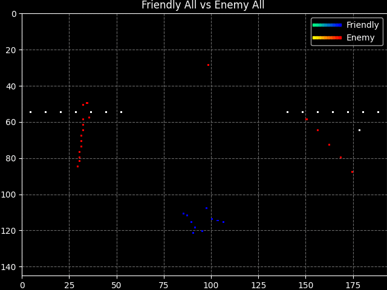
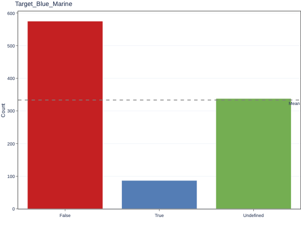
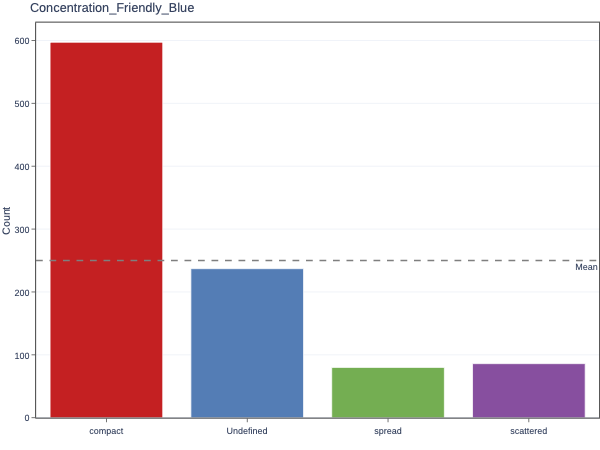
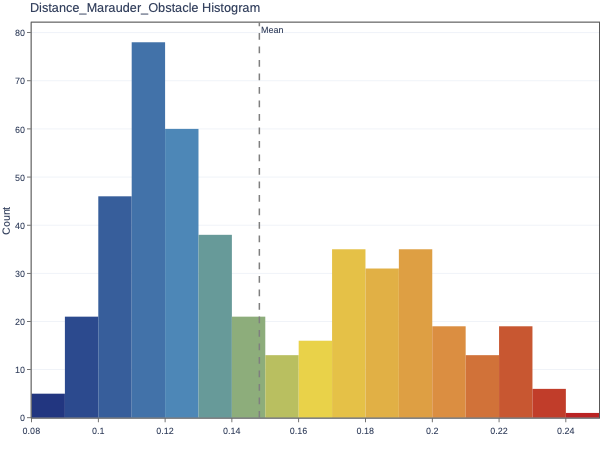
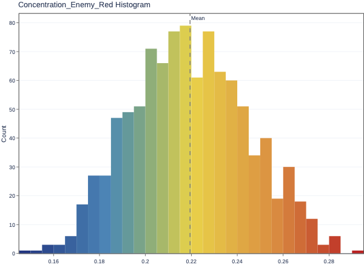

# SC2 Feature Extractor

> StarCraft II high-level feature extractor and replay visualizer

<!-- MarkdownTOC levels="1,2,3" autolink="true" -->

- [Installation](#installation)
- [Dependencies](#dependencies)
- [Feature Extractor](#feature-extractor)
  - [Usage](#usage)
  - [Output](#output)
  - [Feature Extractors](#feature-extractors)
    - [Unit Group](#unit-group)
    - [Distance to Enemy](#distance-to-enemy)
    - [Force Factors](#force-factors)
    - [Force Relative Factors](#force-relative-factors)
    - [Concentration](#concentration)
    - [Elevation](#elevation)
    - [Under Attack](#under-attack)
    - [Force Relative Movement](#force-relative-movement)
    - [Between](#between)
    - [Orders](#orders)
  - [Adding New Extractors](#adding-new-extractors)
- [Units' Location Patterns](#units-location-patterns)
  - [Usage](#usage-1)
  - [Output](#output-1)
- [Features Descriptor](#features-descriptor)
  - [Usage](#usage-2)
  - [Output](#output-2)
- [Feature Statistics](#feature-statistics)
  - [Usage](#usage-3)
  - [Output](#output-3)
- [Examples](#examples)
- [License notice](#license-notice)
- [Support](#support)
- [Acknowledgements](#acknowledgements)

<!-- /MarkdownTOC -->

# Installation

```bash
git checkout https://github.com/SRI-AIC/sc2-feature-extractor.git
cd feature-extractor
pip install -e .
```

# Dependencies

- `pysc2`
- `numpy`
- `scipy`
- `pandas`
- `jsonpickle`
- `tqdm`
- `matplotlib`
- `plotly`
- `kaleido`
- `scikit-video` (`ffmpeg`  backend)

# Feature Extractor

The feature extractor is the main component and allows extracting high-level features from StarCraft II replay files by abstracting over the information already provided by `pysc2` (see https://github.com/deepmind/pysc2/blob/master/docs/environment.md for a description of the actions and observations available). 

The ultimate goal is to transform a given agent replay into a sequence of high-level features describing the behavior of the agent's and opponents' units. 

The feature extractor operates on two modes: one extracting *categorical* data, another extracting *numerical* features.

## Usage

To extract high-level features from one or more replay files use:

```bash
python -m feature_extractor.bin.extract_features
    --replays ${REPLAY_DIR}
    --output ${OUTPUT_DIR}
    --config ${PATH_TO_CONFIG_FILE}
    --categorical {"True", "False"}
    --amount ${NUM_REPLAYS}
    --replay_sc2_version {"latest", "4.10", ...}
    --feature_screen_size ${WIDTH},${HEIGHT}
    --feature_minimap_size ${WIDTH},${HEIGHT}
    --feature_camera_width ${WIDTH}
    --action_space {"FEATURES", "RGB", "RAW"}
    --parallel ${NUM_PARALELL_PROCESSES}
    [--verbosity {0, 1, ...}]
    [--clear {"True", "False"}]
```

- `replays` points to a directory with one or more replay files (`.SC2Replay`) or to a single replay file.

- `config` points to the Json configuration file containing the parameterization for each feature extractor (see  details for each attribute below). Example configuration files are provided in the `feature-extractor/config` directory.

- `categorical` specifies whether to produce categorical features (`"True"`) or numeric features (`"False"`).

> **<u>Notes: </u>** for a full description of all available flags run: 
> 
> ```bash
> python -m feature_extractor.bin.extract_features --helpfull
> ```

## Output

The script produces the following files in the `OUTPUT_DIR` directory:

- `all-traces.tar.gz`, containing, for each processed SC2 replay file, a CSV file named `{replay_file_name}.csv` with all extracted features for all episodes in that replay.

- `feature-dataset.pkl.gz`, containing a pickled pandas' `DataFrame` object with the features for all timesteps of all episodes in each input replay file. This can be loaded using:
  
  ```python
  import pandas as pd
  df = pd.read_pickle("feature-dataset.pkl.gz")
  ```

- if the `keep_csv` flag is set to `True`, then the uncompressed CSV files will be stored under the `output/ep_data` subfolder.

The resulting CSV file (or pandas `DataFrame`) will have a structure similar to this:

|     | Episode | Timestep | File | Present_Friendly_Blue | Present_Friendly_Ground | Present_Friendly_Marauder | ... |
| --- | ------- | -------- | ---- | --------------------- | ----------------------- | ------------------------- | --- |
| 0   | 0       | 0        | ep0  | TRUE                  | TRUE                    | TRUE                      | ... |
| 1   | 0       | 1        | ep0  | TRUE                  | TRUE                    | TRUE                      | ... |
| 2   | 0       | 2        | ep0  | TRUE                  | FALSE                   | TRUE                      | ... |
| ... | ...     | ...      | ...  | ...                   | ...                     | ...                       | ... |
| 451 | 14      | 0        | ep20 | TRUE                  | TRUE                    | TRUE                      | ... |
| 452 | 14      | 1        | ep20 | FALSE                 | FALSE                   | TRUE                      | ... |

where column `Episode` contains an internally generated index for each episode, and column `File` contains the name of the replay file (without extension) from which the episode's features were extracted.

> **<u>Note:</u>** for categorical features, a default value of `'Undefined'` is equivalent to all other categories having the boolean value of `FALSE`. For numeric features, undefined is specified via the `numpy.nan` value.

## Feature Extractors

> **<u>Note:</u>** the feature extractors revolve around the concept of *groups of units*. A group defines the set of unit types against which a certain feature is going to be computed, *i.e.*, it functions as a *filter* for the units within some force. For example, we can specify groups containing only the *aerial* or *ground* units, or groups specifying particular types of *target* units, etc.
> 
> Groups are specified directly in the configuration file by the attribute `"groups"`, corresponding to a dictionary, where each *key* specifies the name of the group, and the corresponding *value* is a list of unit type strings in the format `"RaceEnumType.UnitType"`, as defined in file `pysc2/lib/units.py`. Groups can then be used as filters for feature extractors as described above by specifying the group name in a `"filter"` attribute. In addition, a group can refer to a single type of unit, in which case the corresponding type is used. For example, to refer to the group of marines within a force, the name `"Terran.Marine"` is used.

### Unit Group

- **Description:** an extractor that detects the presence of friendly and enemy unit groups.
  - **Categorical mode:** Boolean features indicating the presence/absence of units of the group.
  - **Numeric mode:** specifies the number of units in the group.
- **Features:** `Present_Friendly_${GROUP_NAME}`, `Present_Enemy_${GROUP_NAME}`
- **Notes:** variable amount, as specified by attributes `"unit_group_friendly_filter"` and `"unit_group_enemy_filter"` of the configuration file, each a list containing the names of groups to be detected for each force.
- **Extractor class:** `feature_extractor.extractors.group.UnitGroupExtractor`

### Distance to Enemy

- **Description:** an extractor that detects the distance between friendly and enemy unit groups, measured as the minimal distance between any two units of each force in those groups.
  - **Categorical mode:** possible values are `melee`, `close`, `far`, according to the thresholds defined respectively by the `"melee_range_ratio"`, `"close_range_ratio"` and `"far_range_ratio"` attributes of the configuration file, corresponding to ratios of the distances to the maximal straight-line distance in the environment.
  - **Numeric mode:** returns the distance as a ratio (value in `[0,1]`) to the maximal straight-line distance in the environment.
- **Features:** `Distance_${FRIENDLY_GROUP_NAME}_${ENEMY_GROUP_NAME}`
- **Notes:** variable amount; unit group filters for each force are specified by attributes `"distance_friendly_filter"` and `"distance_enemy_filter"`, where features are created for all combinations between groups in these filters.
- **Extractor class:** `feature_extractor.extractors.location.distance.DistanceExtractor`

### Force Factors

- **Description:** an extractor that analyzes friendly and enemy groups of units according to some "factor," providing a different label depending on the "level" or "amount" of that factor.
  
  - **Categorical mode:** possible values are variable, different labels for each factor "level" are specified in the configuration file (see notes below).
  - **Numeric mode:** returns the ratio (value in `[0,1]`) between the factor value and the max level value as specified in the configuration file (see notes below).

- **Features:** `${FACTOR_NAME}_Friendly_${GROUP_NAME}`, `${FACTOR_NAME}_Enemy_${GROUP_NAME}`

- **Notes:** force factor features are specified by attribute `"force_factors"` in the configuration file, containing a list of objects with the following attributes:
  
  ```json
  {
    "py/object": "feature_extractor.config.ForceFactorConfig",
    "factor": "FACTOR_NAME",
    "name": "FEATURE_NAME",
    "op": "{sum,mean,min,max,...}",
    "friendly_filter": [
      "GROUP_NAME_1",
      ...
    ],
    "enemy_filter": [
      "GROUP_NAME_1",
      ...
    ],
    "levels": [
      {
        "name": "LEVEL_NAME_1",
        "value": LEVEL_THRESHOLD_1
      },
      {
        "name": "LEVEL_NAME_2",
        "value": LEVEL_THRESHOLD_2
      },
      ...
    ]
  }
  ```
  
  where:
  
  - `"factor"` specifies the unit factor to be analyzed, corresponding to a value of the `pysc2.lib.features.FeatureUnit` enumeration. Additionally, a special `"total_cost"` factor allows capturing the total cost of units, as specified by the attribute `"unit_costs"`, a dictionary where each *key* is a unit type and the corresponding *value* is a list of *costs* (numerical values) associated with that unit type.
  - `"op"` specifies the *numpy operation* to be performed over the units within each force group.
  - `"friendly_filter"` and `"enemy_filter"` specify the names of the groups to be analyzed for each force.
  - `"levels"` is a list specifying the different levels from which the labels for the features are derived, where `"name"` is the label and `"value"` is the value of the operation over the group units below which the label is attributed to the force factor features.

- **Extractor class:** `feature_extractor.extractors.factors.force.ForceFactorsExtractor`

### Force Relative Factors

- **Description:** an extractor that compares friendly and enemy groups of units according to some "factor", providing a different label depending on the "level" or "amount" of the ratio of the sum of that factor between the forces.
  
  - **Categorical mode:** there are three possible values as specified by the relative factor labels of `"advantage"`, `"disadvantage"` and `"balanced"` in the configuration file (see notes below).
  
  - **Numeric mode:** returns the normalized ratio (value in `[-1, 1]`) between the force factors values of friendly and enemy forces: `0` if equal value, i.e., balanced; `< 0` if in friendly force is disadvantaged, `> 0` if friendly force is in advantage.

- **Features:** `Relative${FACTOR_NAME}_${FRIENDLY_GROUP_NAME}_${ENEMY_GROUP_NAME}`

- **Notes:** force factor features are specified by attribute `"force_relative_factors"` in the configuration file, containing a list of objects with the following attributes:
  
  ```json
  {
    "py/object": "feature_extractor.config.ForceRelativeFactorConfig",
    "factor": "FACTOR_NAME",
    "name": "FEATURE_NAME",
    "friendly_filter": [
      "GROUP_NAME_1",
      ...
    ],
    "enemy_filter": [
      "GROUP_NAME_1",
      ...
    ],
    "ratio": RATIO_VALUE,
    "advantage": ADVANTAGE_LABEL,
    "disadvantage": DISADVANTAGE_LABEL,
    "balanced": BALANCED_LABEL
  }
  ```
  
  where:
  
  - `"factor"` specifies the unit factor to be analyzed, corresponding to a value of the `pysc2.lib.features.FeatureUnit` enumeration. As described above, a special `"total_cost"` factor allows capturing the total cost of units, as specified by the attribute `"unit_costs"`, a dictionary where each *key* is a unit type and the corresponding *value* is a list of *costs* (numerical values) associated with that unit type.
  - `"friendly_filter"` and `"enemy_filter"` specify the names of the groups to be analyzed for each force. Features are created for all combinations between groups in these filters.
  - `"ratio"` specifies the ratio between the sum of the factor values of friendly and enemy units below which the friendly force is considered to be in minority/disadvantage, resulting in the label specified by `"disadvantage"` being selected for the feature. If the inverse is true, *i.e.*, if the force factor ratio is above  `1/"ratio"`, then the friendly force is considered to be in majority/advantage, resulting in the label specified by `"advantage"` being selected. Otherwise, the feature's value will be the label specified by the `"balanced"` attribute.

- **Extractor class:** `feature_extractor.extractors.factors.force_relative.ForceRelativeFactorsExtractor`

### Concentration

- **Description:** an extractor that computes how concentrated/compact the friendly and enemy forces are, calculated according to the average pairwise distance of units within each force.
  
  - **Categorical mode:** possible values are `compact`, `spread`, `scattered`, selected according to concentration thresholds specified respectively by the `"compact_ratio"`, `"spread_ratio"` and `"scattered_ratio"` attributes of the configuration file, corresponding to percentages of the maximal straight-line distance in the environment below which the corresponding label is selected.
  
  - **Numeric mode:** returns the ratio (value in `[0,1]`) between the average pairwise distance of units within each force and the maximal straight-line distance in the environment.

- **Features:** `Concentration_Friendly_${GROUP_NAME}`, `Concentration_Enemy_${GROUP_NAME}`

- **Notes:**  variable amount; attributes `"concentration_friendly_filter"` and `"concentration_enemy_filter"` are lists containing the names of groups to be detected for each force. 

- **Extractor class:** `feature_extractor.extractors.location.concentration.ConcentrationExtractor`

### Elevation

- **Description:** an extractor that computes the mean elevation of friendly and enemy groups of units.
  - **Categorical mode:** possible values are `low`, `medium`, `high`, selected according to the terrain elevation thresholds specified respectively by the `"low_elevation"`, `"medium_elevation"` and `"high_elevation"` attributes of the configuration file, corresponding to absolute terrain heights below which the corresponding label is selected.
  - **Numeric mode:** returns the average value of elevation for the group's units.
- **Features:** `Elevation_Friendly_${GROUP_NAME}`, `Elevation_Enemy_${GROUP_NAME}`
- **Notes:** variable amount; attributes `"elevation_friendly_filter"` and `"elevation_enemy_filter"` are lists containing the names of groups to be detected for each force. 
- **Extractor class:** `feature_extractor.extractors.location.elevation.ElevationExtractor`

### Under Attack

- **Description:** an extractor that detects whether friendly and enemy groups of units are under attack by monitoring the difference of the sum of their health between consecutive timesteps.
  - **Categorical mode:** Boolean features indicating whether the sum of the group's units health is decreasing, i.e., `< 0`.
  - **Numeric mode:** returns the difference of the sum of the group's units health between consecutive timesteps. Usually this is a value in `]-∞,0]`.
- **Features:** `UnderAttack_Friendly_${GROUP_NAME}`, `UnderAttack_Enemy_${GROUP_NAME}`
- **Notes:** under attack does not necessarily mean that the opponent is attacking, although in most combat scenarios this is true. Attributes `"under_attack_friendly_filter"` and `"under_attack_enemy_filter"` are lists containing the names of groups to be detected for each force. 
- **Extractor class:** `feature_extractor.extractors.factors.under_attack.UnderAttackExtractor`

### Force Relative Movement

- **Description:** an extractor that detects the movement of groups of friendly and enemy forces relative to each other. The movement is calculated by computing the *velocity*, measured between two consecutive time steps, of the forces' center of mass, where this location is only considered for units that are present in *both* time steps, and the *angle* between a forces' movement direction and the location of the opponent's center-of-mass.
  - **Categorical mode:** Boolean features indicating whether the forces are advancing/retreating relative to each other. whether a force is moving (as opposed to being "still") depends on the `"velocity_threshold"` attribute of the configuration file, corresponding to the amount of spatial units moved per update step of a force's center of mass. The movement of forces relative to each other, *i.e.*, advance and retreat, is controlled by attributes `"advance_angle_thresh"` and `"retreat_angle_thresh"`, respectively, corresponding to the angle range (in radians), between a forces' movement direction and the location of the opponent's center-of-mass, within which the corresponding label is selected. The `Undefined` label is selected if the force is moving but the angle does not fit within the aforementioned ranges.
  - **Numeric mode:** returns: the relative velocity (magnitude) of the forces' center of mass as a ratio (value in `[0,1]`) to the `"max_velocity"` attribute of the configuration file; the angle (value in `[0,π]`) between the direction of the force's movement and the opponent force.
- **Features:** 
  - **Categorical mode:** `Advancing_Friendly_${FRIENDLY_GROUP_NAME}_${ENEMY_GROUP_NAME}`, `Retreating_Friendly_${FRIENDLY_GROUP_NAME}_${ENEMY_GROUP_NAME}`, `Advancing_Enemy_${ENEMY_GROUP_NAME}_${FRIENDLY_GROUP_NAME}`, `Retreating_Enemy_${ENEMY_GROUP_NAME}_${FRIENDLY_GROUP_NAME}`
  - **Numeric mode:** `Velocity_Friendly_${FRIENDLY_GROUP_NAME}_${ENEMY_GROUP_NAME}`, `Angle_Friendly_${FRIENDLY_GROUP_NAME}_${ENEMY_GROUP_NAME}`, `Velocity_Enemy_${ENEMY_GROUP_NAME}_${FRIENDLY_GROUP_NAME}`, `Angle_Enemy_${ENEMY_GROUP_NAME}_${FRIENDLY_GROUP_NAME}`
- **Notes:** variable amount; attributes `"friendly_move_friendly_filter"`, `"friendly_move_enemy_filter"`, `"enemy_move_enemy_filter"` and `"enemy_move_friendly_filter"` are lists containing the names of groups to be detected for each force. Features are created for all combinations between groups in these filters.
- **Extractor class:** `feature_extractor.extractors.location.movement._RelativeMovementExtractor`

### Between

- **Description:** an extractor that detects whether an enemy "barrier" (unit type group) is between friendly and enemy units within different groups.
  - **Categorical mode:** Boolean features indicating whether a certain percentage of the friendly and enemy unit pairs are considered as having a barrier between them. The percentage threshold is specified by the `"between_units_ratio"` attribute of the configuration file, while attribute `"barrier_angle_threshold"` specifies the tolerance, in radians, for a barrier point to be considered as "on the line" formed by a pair of friendly and enemy units belonging to the corresponding group.
  - **Numeric mode:** returns the percentage (ratio, a value in `[0,1]`) of the pairs of friendly and enemy units that are considered to have a barrier between them. Similar to the categorical mode, attribute `"barrier_angle_threshold"` of the configuration file is used to check for barriers between pairs of units. 
- **Features:** `Between_${BARRIER_GROUP}_${FRIENDLY_GROUP}_${ENEMY_GROUP}`
- **Notes:** variable amount; attributes `"between_friendly_filter"` and `"between_enemy_filter"` are lists containing the names of groups to be detected for each force, while attribute `"between_barrier_filter"` specifies the enemy groups of units considered as "barriers". Features are created for all combinations between groups in these three filters.
- **Extractor class:** `feature_extractor.extractors.location.between.BetweenExtractor`

### Orders

- **Description:** an extractor that detects whether units within a group of friendly or enemy forces are carrying out some behavior dictated by a set of `pysc2` low-level "orders".
  
  - **Categorical/Numeric mode:** Boolean features indicating the presence/absence of units of the group who are executing raw abilities/behaviors specified by the order type.

- **Features:** `${ORDER_NAME}_FRIENDLY_${FRIENDLY_GROUP_NAME}`, `${ORDER_NAME}_ENEMY_${ENEMY_GROUP_NAME}`

- **Notes:** orders features are specified by attributes `"friendly_orders"` and `"enemy_orders"` in the configuration file, each a list of objects with the following attributes:
  
  ```json
  {
    "py/object": "feature_extractor.config.OrderConfig",
    "name": "ORDER_TYPE_NAME",
    "unit_group_filter": [
      "GROUP_NAME_1",
      ...
    ],
    "raw_abilities": [
      RAW_ABILITY_1,
      ...
    ]
  }
  ```
  
  where:
  
  - `"unit_group_filter"` specifies the names of the groups to be analyzed. Features are created for all groups in this filter.
  - `"raw_abilities"`  is a list containing the number identifiers of the raw SC2 abilities that we want to detect for each order type. The list of ids can be retrieved from the `_RAW_FUNCTIONS` object in `pysc2/lib/actions.py`.

- **Extractor classes:** `feature_extractor.extractors.actions.orders.*`

## Adding New Extractors

To add a new feature extractor, simply implement a sub-class of `feature_extractor.extractors.FeatureExtractor`:

```python
class MyExtractor(FeatureExtractor):

    def __init__(self, config):
        super().__init__(config)

    def features_labels(self):
        return ['my_feature1_label', 'my_feature2_label', ...]

    def features_descriptors(self):
        return [FeatureDescriptor('my_feature1_label', FeatureType.TYPE), ...]

    def extract(self, ep, step, obs):
        return [my_feature1_value, my_feature2_value, ...]

    # optional
    def reset(self, obs):
        ...
```

Then add a new instance of that class when creating the `ExtractorListener`, e.g., by editing `feature_extractor.bin.extract_features._create_extractors`:

```python
return { FRIENDLY_STR: [ MyExtractor(config), ...], ENEMY_STR: [...]}
```

---

# Units' Location Patterns

This visualization tool plots the locations of friendly and enemy groups of units over time given a set of traces (SC2 episodes). The idea is to capture an agent’s behavior patterns as manifested by its and the enemy’s units’ movement. We can use this tool to visualize the location patterns for the set of traces for each cluster resulting from the clustering mechanism (although the tool is algorithm-independent). 

## Usage

To visualize the locations of units for a set of replay files use:

```shell
python -m feature_extractor.bin.visualize_locations
    --replays ${REPLAY_DIR}
    --config ${CONFIG}
    --output ${OUTPUT_DIR}
    [--feature_screen_size ${WIDTH},${HEIGHT}]
    [--feature_minimap_size ${WIDTH},${HEIGHT}]
    [--feature_camera_width ${WIDTH}]
    [--action_space {"FEATURES", "RGB", "RAW"}]
    [--step_mul ${STEP_MUL}]
    [--replay_sc2_version {"latest", "4.10"}]
    [--clusters_file ${PATH_TO_CLUSTERS_CSV_FILE}]
    [--dark {"True", "False"}]
    [--parallel ${NUM_PARALELL_PROCESSES}]
    [--format ${IMG_FILE_EXTENSION}]
    [--verbosity {0, 1, ...}]
    [--clear {"True", "False"}]
```

where:

- `replays`: path to a directory containing the `.SC2Replay` files to be visualized.
- `config`: path to the `feature-extractor` configuration file specifying the groups of unit types to be tracked.
- `output`: path to directory in which to save results.
- `feature_screen_size`: resolution for the SC2 screen feature layers (default is `64`, but use `192,144` for CARLI combat scenarios).
- `feature_minimap_size`: resolution for the SC2 minimap feature layers (default is `64`, but use `72` for CARLI combat scenarios).
- `feature_camera_width`: width of the SC2 feature layer camera (default is `24`, but use `48` for CARLI combat scenarios).
- `action_space`: action space for the SC2 agent interface format (default is `RAW`)
- `step_mul`: SC2 game steps per observation of the original replay files (default is `8`).
- `replay_sc2_version`: SC2 version to use for replay, either `x.y.z` or `"latest"`. If not specified (default), the version should be inferred from the replay file (use `"latest"` for CARLI replays).
- `clusters_file`: path to a CSV file containing references to the replay files organized by some cluster/group ID. In particular, the CSV file should have at least 2 columns: `"Cluster"`, specifying the cluster identifier for each trace/replay; `"Trace ID"`, containing the name of the replay file in `REPLAY_DIR` for the corresponding trace. If the clusters file is supplied, then locations will be computed and visualized for each cluster and results will be organized by cluster ID in the `OUTPUT_DIR` directory. If `None` (default), then the locations will be processed for all files in the `REPLAY_DIR`.
- `dark`: whether to use a dark theme/background for plotted figures (default is `"True"`).
- `parallel`: number of processes for parallel processing. Value `< 1` uses all available cpus (default is `1`).
- `format`: format of resulting images (default is `"png"`).
- `clear`: whether to clear output directories before generating results.
- `verbosity`: verbosity level for `logging`.

> **<u>Note:</u>** for a full description of all available flags run:
> 
> ```bash
> python -m feature_extractor.bin.visualize_locations --helpfull
> ```

## Output

The script produces animations like the following under `OUTPUT_DIR` (or `OUTPUT_DIR/cluster-x` if `clusters_file` is supplied) as well as still images of the last step:

|  |  |
| ----------------------------------------------------------------------------------------------------------------- | ----------------------------------------------------------------------------------------------------------------- |

Each plot shows the distribution of units over space and time using the following visual properties:

- **Location:** the plots represent the location of units in the game board using a top-down view. The entire game board is visualized, and each $x,y$ location on the plot corresponds to the cell with those coordinates on the board.

- **Color map:** we use color maps to distinguish between the Friendly and Enemy units. In particular, a green-to-blue color map is used to represent the location of the Friendly (agent's) units over time, and a yellow-to-red color map to represent the location of the Enemy units.

- **Color value:** within each color map, the color of each $x,y$ location on the plot represents the average relative time that units have occupied the corresponding cell on the game board. Because traces have different length, we first normalize each timestep of a trace in the `[0,1]` interval such that values near `0` correspond to the presence of units in some location occurring on average at the beginning of traces, while values near `1` correspond to the presence of units near the end of traces. Given the provided timestep threshold 𝑡, for each location and each force we then compute the average relative time that the corresponding cell was visited by any unit of that force across all traces. Lighter colors within each color map (green/yellow) represent a lower average time value, while darker colors (blue/red) represent higher time values.

- **Transparency:** to avoid visual cluttering, we set the transparency of each pixel in the plot to be proportional to the relative frequency of the corresponding cell’s occupancy during the traces. As such, locations that were infrequently visited by the Friendly and/or Enemy units will have a lower value assigned to the alpha channel of the resulting image. We also use transparency to visualize locations that were occupied by both the Friendly and Enemy units such that both colors can be blended and visualized.

- **Time:** because different traces might have different time lengths, we linearly interpolate time in the `[0, 1]` interval to get a sequence of images corresponding to the evolution of units’ locations in each trace over time. We note that each image frame in the animation still visualizes what occurred up to relative timestep $t$ in all traces starting from the initial timestep `0`.

---

# Features Descriptor

This tool loads a feature configuration file and generates a Json file containing  the description of the features that will be generated by running the feature extractor under that configuration. This includes the feature names, their types, and possible values (for categorical features) or possible feature value ranges (for numeric features).

## Usage

To get a feature descriptor for some configuration file use:

```shell
python -m feature_extractor.bin.feature_descriptor
    --output ${OUTPUT_DIR}
    --config ${PATH_TO_CONFIG_FILE}
    --categorical {"True", "False"}
    [--verbosity {0, 1, ...}]
    [--clear {"True", "False"}]
```

where:

- `output` points to the directory in which to save the feature descriptor file.

- `config` points to the Json configuration file containing the parameterization for each feature extractor.

- `categorical` specifies whether to produce categorical features (`"True"`) or numeric features (`"False"`).

## Output

The tool will produce a Json file in `OUTPUT/features_desc.json` similar to the following:

```json
{
    "meta": [
        {
            "type": "Integer",
            "name": "Episode",
            "values": [
                0,
                9223372036854775807
            ]
        },
        ...
    ],
    "conditions": [
        {
            "type": "Integer",
            "name": "Present_Friendly_Blue",
            "values": [
                0,
                32
            ]
        },
        ...
    ],
    "tactics": {
        "Blue": [
            {
                "type": "Boolean",
                "name": "MoveOrder_Friendly_Blue",
                "values": null
            },
            ...
        ],
        ...
    }
}
```

where features are organized under three categories:

- `meta`: the metadata features, including `Episode`, `Timestep` and `File`.

- `conditions`: features that help describe the state of the environment.

- `tactics`: features that help describe the agent's behavior, organized by unit group.

---

# Feature Statistics

After feature extraction we can run a tool that generates statistics out of the feature files. This can be useful to get an overview of the tendencies in the replay data.

## Usage

To run the feature statistics tool on a feature dataset, run:

```shell
python -m feature_extractor.bin.feature_stats
    --input ${FEATURES_DIR}
    --output ${OUTPUT_DIR}
    [--desc ${FEATURES_DESCRIPTOR_FILE}]
    [--match ${REG_EXPRESSION}]
    [--parallel ${NUM_PARALELL_PROCESSES}]
    [--format ${IMG_FILE_EXTENSION}]
    [--verbosity {0, 1, ...}]
    [--clear {"True", "False"}]
```

where:

- `input` points to the path to the file (zip or CSV) or directory containing the extracted features.

- `output` points to the path to the directory in which to save the files with the results.

- `desc` points to the path to the JSON file containing the feature descriptions, generated using the feature descriptor tool (see above).

- `match` regular expression used to filter features by name (optional).

> **<u>Note:</u>** for a full description of all available flags run:
> 
> ```bash
> python -m feature_extractor.bin.feature_stats --helpfull
> ```

## Output

The tool will output bar charts like the following if the feature-extractor was run in *categorical mode*:

|  |  |
| ----------------------------------------------------------------------------------------------------------- | ----------------------------------------------------------------------------------------------------------- |

And histograms like the following if the feature-extractor was run in *numeric mode*:

|  |  |
| --------------------------------------------------------------------------------------------------- | --------------------------------------------------------------------------------------------------- |

Results are stored in the following sub-directories of `OUTPUT_DIR`, each capturing different feature statistics:

- `first-step`: statistics regarding first step values of features across replays: counts for each category (categorical mode) / distribution (numeric mode).

- `last-step`: statistics regarding last step values of features across replays: counts for each category (categorical mode) / distribution (numeric mode).

- `all-steps`: statistics regarding features' values across all timesteps of replays: total counts for each category (categorical mode) / distribution (numeric mode).

- `all-episodes`: statistics regarding features' values over all replays: number of episodes in which a category was present in at least one timestep (categorical mode) / mean value distribution per episode (numeric mode).

- `sequence`: mean of maximum consecutive constant feature value steps per episode (categorical mode only).

---

# Examples

The `scripts` sub-directory contains a series of example bash shell scripts that produce replays, extract features and feature stats and generate visualizations for the DefeatRoaches mini-game. 

> **<u>Note:</u>** Instructions on how to install the maps can be found at: [GitHub - deepmind/pysc2: StarCraft II Learning Environment](https://github.com/deepmind/pysc2#get-the-maps)

The following scripts are included:

- `00_generate_replays.sh`: generates replay files for the DefeatRoaches task.

- `01_extract_features.sh`: extracts features for the generated replays using the configuration file in `config/roaches.json`.

- `02_features_descriptor.sh`: generates the feature descriptor file for the abovementioned feature configuration file.

- `03_features_stats.sh`: generates statistics of the extracted features.

- `04_visualize_locations.sh`: produces visualizations of the locations of units over time for the generated replays.

---

# License notice

The code is provided under the GPLv3 license (see [`LICENSE.md`](LICENSE.md)). To use the code under a different set of licensing terms, please contact [SRI International](https://www.sri.com/)'s licensing department at [licensee-ops@sri.com](mailto:licensee-ops@sri.com).

# Support

If you have questions about using this package or find errors in the code you can post an issue or contact [Pedro Sequeira](mailto:pedro.sequeira@sri.com)  or [Melinda Gervasio](mailto:melinda.gervasio@sri.com).

# Acknowledgements

This material is based upon work supported by the Defense Advanced Research Projects Agency (DARPA) under Contract No. HR001119C0112.CA
